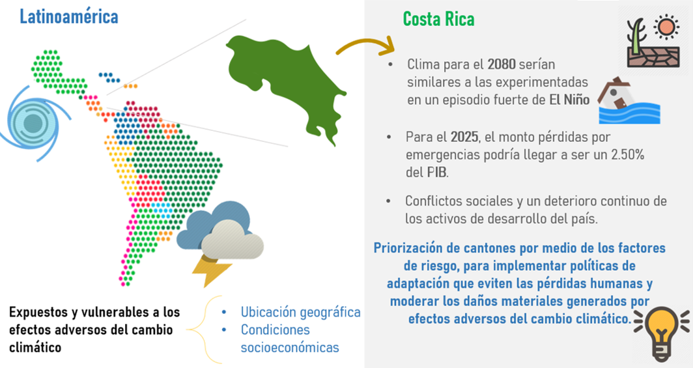

```{r setup, include=FALSE}
knitr::opts_chunk$set(echo = FALSE, comment = " ", warning=FALSE, cache=TRUE)


library(sf)
library(spData)
library(tidyverse)

library(rgdal)
library(maptools)
library(raster)
library(ggplot2)
library(ggspatial)
library(spatstat)

library(gstat)
library(lattice)

library(knitr)
library(kableExtra)


# Function to get the earth distance beetween two points in the map
earth.dist <- function (long1, lat1, long2, lat2)
{
rad <- pi/180
a1 <- lat1 * rad
a2 <- long1 * rad
b1 <- lat2 * rad
b2 <- long2 * rad
dlon <- b2 - a2
dlat <- b1 - a1
a <- (sin(dlat/2))^2 + cos(a1) * cos(b1) * (sin(dlon/2))^2
c <- 2 * atan2(sqrt(a), sqrt(1 - a))
R <- 6372.79
d <- R * c
return(d)
}

# Function to calculate the RMSE value
RMSE <- function(observed, predicted) {
  sqrt(mean((predicted - observed)^2, na.rm=TRUE))
}

# Load Costa Rica Cantones
Cantones.sf <- sf::st_read("Cantones_de_Costa_Rica.shp") 

#path <- "Cantones_de_Costa_Rica.shp"
#Cantones <- shapefile(path)

Cantones.sf<-Cantones.sf %>% sf::st_transform(crs = sf::st_crs(4326))

Cantones<-as(Cantones.sf, 'Spatial')

Cantones@bbox<-as.matrix(rbind(c(-85.97907,-82.55232),c(8.039627,11.21976)))

Cantones.sf<-sf::st_as_sf(Cantones)

#perdidas


perdidas<-read.csv(file = "datos_perdida.csv",sep=";",dec=",", check.names = F, encoding = "UTF-8")
names(perdidas)<-iconv(names(perdidas), to = "ASCII", sub = "")
dim(perdidas)
head(perdidas)

perdidas$p<-as.factor(perdidas$p)
perdidas$c<-as.factor(perdidas$c)

perd_cantones_sf<-Cantones.sf %>% left_join(perdidas %>% dplyr::select(-"perdida"), 
                                by=c("COD_PROV"="p",
                                     "COD_CANT"="c"))

perd_cantones<-as(perd_cantones_sf, 'Spatial')


# add the right proyection

#projection(perd_cantones)=projection(Cantones)  

#Quitar la isla del Coco

perd_cantones@bbox<-as.matrix(rbind(c(-85.97907,-82.55232),c(8.039627,11.21976)))

perd_cantones_sf<-sf::st_as_sf(perd_cantones)

```

## Introducción {data-background=fondo_ppt.png data-background-size=cover .centered}

{ width=90% }

## Objetivos {data-background=fondo_ppt.png data-background-size=cover .centered}

{ width=90% }


## Resultados {data-background=fondo_ppt.png data-background-size=cover}

### Distribución del monto en pérdidas

```{r, echo = FALSE}
plotly::ggplotly(ggplot() +
  geom_sf(data = perd_cantones_sf, aes(geometry=geometry, fill = perdida_mill, text=NOM_CANT_1))+
  ggtitle("Distribución del monto en pérdidas por eventos hidrometeorológicos por \n declaratoria de emergencia, Costa Rica. ")+
  labs(fill="Pérdida en millones \n de colones")+
  scale_fill_distiller(palette = "Spectral")+
   theme_bw()+
  theme(legend.title = element_text(size=8),
        legend.text = element_text(size=8),
        plot.title = element_text(hjust = 0.5, size=10),
        axis.title = element_text(size = 9),
        axis.text =  element_text(size = 8))+
  annotation_north_arrow(location = "bl", which_north = "true", 
        pad_x = unit(0.5, "in"), pad_y = unit(0.3, "in"),
        style = north_arrow_fancy_orienteering) +
  annotation_scale(location = "bl", width_hint = 0.4)+
  xlab("Longitud") + ylab("Latitud")+
    coord_sf(xlim = c(-85.97907, -82.55232), ylim = c(8.039627, 11.21976), expand = FALSE), tooltip=c("fill","text"))

```

## Resultados {data-background=fondo_ppt.png data-background-size=cover}

### Monto en pérdidas

```{r, echo = FALSE}
datos<-as.data.frame(perd_cantones_sf)

box<-ggplot(datos,aes(x=" ", y=perdida_mill))+
      geom_boxplot(fill="#48C9B0",alpha=0.75)+
  theme_bw()+
  labs(y="Monto",
       x=" ")+
  theme(axis.text = element_text(size = 8),
        axis.title = element_text(size = 8))+
  coord_flip()

histo<-ggplot(datos, aes(x=perdida_mill)) +
   geom_histogram(aes( y=..density..),binwidth=5000, alpha=.75, 
                  position="identity",fill="#F9E79F",colour="black") +
  #geom_density(alpha=0.75,fill="#F9E79F")+
   theme_bw()+
  labs(y="Densidad",
       x="Monto")+
  theme(axis.text = element_text(size = 8),
        axis.title = element_text(size = 8))

ggpubr::ggarrange(histo,box, ncol = 2, nrow = 1)
```


## Resultados {data-background=fondo_ppt.png data-background-size=cover}

### Covariables

```{r}
#variables indepednientes
ids<-ggplot() +
  geom_sf(data = perd_cantones_sf, aes(geometry=geometry, fill = IDS))+
  ggtitle("IDS")+
  labs(fill=" ")+
  scale_fill_distiller(palette = "Spectral")+
   theme_bw()+
  theme(legend.title = element_text(size=8),
        legend.text = element_text(size=8),
        plot.title = element_text(hjust = 0.5, size=10),
        axis.title = element_text(size = 8),
        axis.text =  element_text(size = 4))+
  xlab("Longitud") + ylab("Latitud")+
    coord_sf(xlim = c(-85.97907, -82.55232), ylim = c(8.039627, 11.21976), expand = FALSE)

IGM_Des_Gest_Inst<-ggplot() +
  geom_sf(data = perd_cantones_sf, aes(geometry=geometry, fill = IGM_Desarrollo_Gestion_Inst))+
  ggtitle("Desarrollo y Gestión Institucional")+
  labs(fill=" ")+
  scale_fill_distiller(palette = "Spectral")+
   theme_bw()+
  theme(legend.title = element_text(size=8),
        legend.text = element_text(size=8),
        plot.title = element_text(hjust = 0.5, size=10),
        axis.title = element_text(size = 8),
        axis.text =  element_text(size = 4))+
  xlab("Longitud") + ylab("Latitud")+
    coord_sf(xlim = c(-85.97907, -82.55232), ylim = c(8.039627, 11.21976), expand = FALSE)

IGM_Planif_Partic_Ciud_Rend_Cuent<-ggplot() +
  geom_sf(data = perd_cantones_sf, aes(geometry=geometry, fill = IGM_Planif_Partic_Ciud_Rend_Cuent))+
  ggtitle("Planificación, Participación Ciudadana \n y Rendición de Cuentas")+
  labs(fill=" ")+
  scale_fill_distiller(palette = "Spectral")+
   theme_bw()+
  theme(legend.title = element_text(size=8),
        legend.text = element_text(size=8),
        plot.title = element_text(hjust = 0.5, size=10),
        axis.title = element_text(size = 8),
        axis.text =  element_text(size = 4))+
  xlab("Longitud") + ylab("Latitud")+
    coord_sf(xlim = c(-85.97907, -82.55232), ylim = c(8.039627, 11.21976), expand = FALSE)

IGM_Gestion_Desarrollo_Amb<-ggplot() +
  geom_sf(data = perd_cantones_sf, aes(geometry=geometry, fill = IGM_Gestion_Desarrollo_Amb))+
  ggtitle("Gestión de Desarrollo Ambiental")+
  labs(fill=" ")+
  scale_fill_distiller(palette = "Spectral")+
   theme_bw()+
  theme(legend.title = element_text(size=8),
        legend.text = element_text(size=8),
        plot.title = element_text(hjust = 0.5, size=10),
        axis.title = element_text(size = 8),
        axis.text =  element_text(size = 4))+
  xlab("Longitud") + ylab("Latitud")+
    coord_sf(xlim = c(-85.97907, -82.55232), ylim = c(8.039627, 11.21976), expand = FALSE)

IGM_Gestion_Servicios_Econ<-ggplot() +
  geom_sf(data = perd_cantones_sf, aes(geometry=geometry, fill = IGM_Gestion_Servicios_Econ))+
  ggtitle("Gestión de Servicios Económicos")+
  labs(fill=" ")+
  scale_fill_distiller(palette = "Spectral")+
   theme_bw()+
  theme(legend.title = element_text(size=8),
        legend.text = element_text(size=8),
        plot.title = element_text(hjust = 0.5, size=10),
        axis.title = element_text(size = 8),
        axis.text =  element_text(size = 4))+
  xlab("Longitud") + ylab("Latitud")+
    coord_sf(xlim = c(-85.97907, -82.55232), ylim = c(8.039627, 11.21976), expand = FALSE)

IGM_Gestion_Serv_Social<-ggplot() +
  geom_sf(data = perd_cantones_sf, aes(geometry=geometry, fill = IGM_Gestion_Serv_Social))+
  ggtitle("Gestión de Servicios Sociales")+
  labs(fill=" ")+
  scale_fill_distiller(palette = "Spectral")+
   theme_bw()+
  theme(legend.title = element_text(size=8),
        legend.text = element_text(size=8),
        plot.title = element_text(hjust = 0.5, size=10),
        axis.title = element_text(size = 8),
        axis.text =  element_text(size = 4))+
  xlab("Longitud") + ylab("Latitud")+
    coord_sf(xlim = c(-85.97907, -82.55232), ylim = c(8.039627, 11.21976), expand = FALSE)

poblac_total<-ggplot() +
  geom_sf(data = perd_cantones_sf, aes(geometry=geometry, fill = poblac_total))+
  ggtitle("Densidad de población")+
  labs(fill=" ")+
  scale_fill_distiller(palette = "Spectral")+
   theme_bw()+
  theme(legend.title = element_text(size=8),
        legend.text = element_text(size=8),
        plot.title = element_text(hjust = 0.5, size=10),
        axis.title = element_text(size = 8),
        axis.text =  element_text(size = 4))+
  xlab("Longitud") + ylab("Latitud")+
    coord_sf(xlim = c(-85.97907, -82.55232), ylim = c(8.039627, 11.21976), expand = FALSE)


ggpubr::ggarrange(ids, IGM_Des_Gest_Inst, IGM_Gestion_Desarrollo_Amb,
          IGM_Gestion_Serv_Social, ncol = 2, nrow = 2)

```

## Resultados {data-background=fondo_ppt.png data-background-size=cover}

### Covariables

```{r}
ggpubr::ggarrange(IGM_Gestion_Servicios_Econ,IGM_Planif_Partic_Ciud_Rend_Cuent,poblac_total, ncol = 2, nrow = 2)
```


## Resultados {data-background=fondo_ppt.png data-background-size=cover}

### Test de Moran en las pérdidas

```{r,fig.align='center', fig.height= 4, fig.width= 8}
library(spdep)

list.queen<-poly2nb(perd_cantones, queen=TRUE)
W<-nb2listw(list.queen, style="W", zero.policy=TRUE)

moran.test(perd_cantones$perdida_mill, W)

```

## Resultados {data-background=fondo_ppt.png data-background-size=cover}

### Test de Moran en las pérdidas

```{r}
moran.plot(perd_cantones$perdida_mill, listw=nb2listw(list.queen, style="W"), quiet=TRUE,labels = NULL,xlab="Pérdidas", ylab="Pérdias espacialmente rezagadas");title("Moran scatterplot")

```


## Resultados {data-background=fondo_ppt.png data-background-size=cover}

### Modelo SAR 

```{r}

nysar<-spautolm(perdida_mill~IDS,
                data=perd_cantones@data, listw=W)
summary(nysar)

```

## Resultados {data-background=fondo_ppt.png data-background-size=cover}

### Modelo CAR 

```{r}
nycar2<-spautolm(perdida_mill~IDS+poblac_total,
                data=perd_cantones@data, family="CAR",
                listw=W)
summary(nycar2)
```


## Resultados {data-background=fondo_ppt.png data-background-size=cover}

### Prueba de Moran de residuos

```{r}
regresion<-lm(perdida_mill~IDS+poblac_total+
                IGM_Desarrollo_Gestion_Inst+IGM_Planif_Partic_Ciud_Rend_Cuent+
                IGM_Gestion_Desarrollo_Amb+IGM_Gestion_Servicios_Econ+IGM_Gestion_Serv_Social
              , data=perd_cantones@data)

moran.lm<-lm.morantest(regresion, W, alternative="two.sided")
print(moran.lm)
```

## Resultados {data-background=fondo_ppt.png data-background-size=cover}

### Regresión Lineal

```{r}
regresion.final<-lm(perdida_mill~IDS, data=perd_cantones@data)

summary(regresion.final)
```


## Resultados {data-background=fondo_ppt.png data-background-size=cover .centered}


## Conclusiones {data-background=fondo_ppt.png data-background-size=cover}

1) Se obtiene una distribución espacial las pérdidas por eventos con declaratoria de emergencia, la cual constituye a una herramienta útil, para comprender su comportamiento. 

2) Se halló que entre mayor calidad de vida de los seres humanos en sus respectivos cantones menor el montón en las pérdidas por eventos con declaratoria de emergencia, lo cual indica que parte del desarrollo en economía, salud, educación y seguridad implementado por las municipales, juega un papel importante en la disminución en pérdidas.

3) La priorización promueve la implementación de políticas de adaptación **preventivas** tanto en los cantones que ya han afectados por eventos de emergencia como los cantones que aún no han presentado gran cantidad de pérdidas.

4) Para enriquecer los resultados obtenidos se recomienda incorporar variables meteorológicas, puesto que puede que expliquen de mejor manera el comportamiento de las pérdidas, de esta manera obtener una priorización de cantones más exacta.
